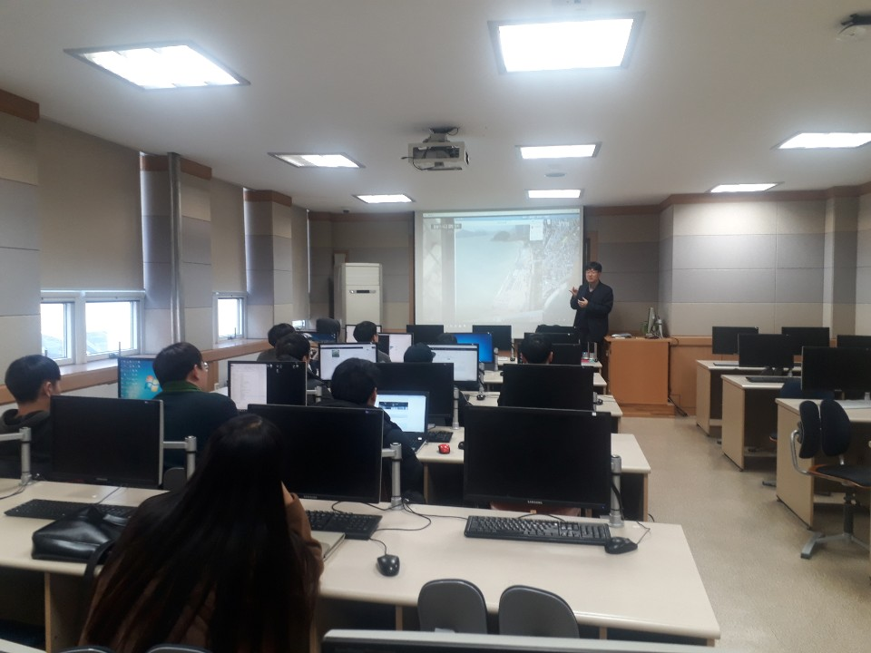
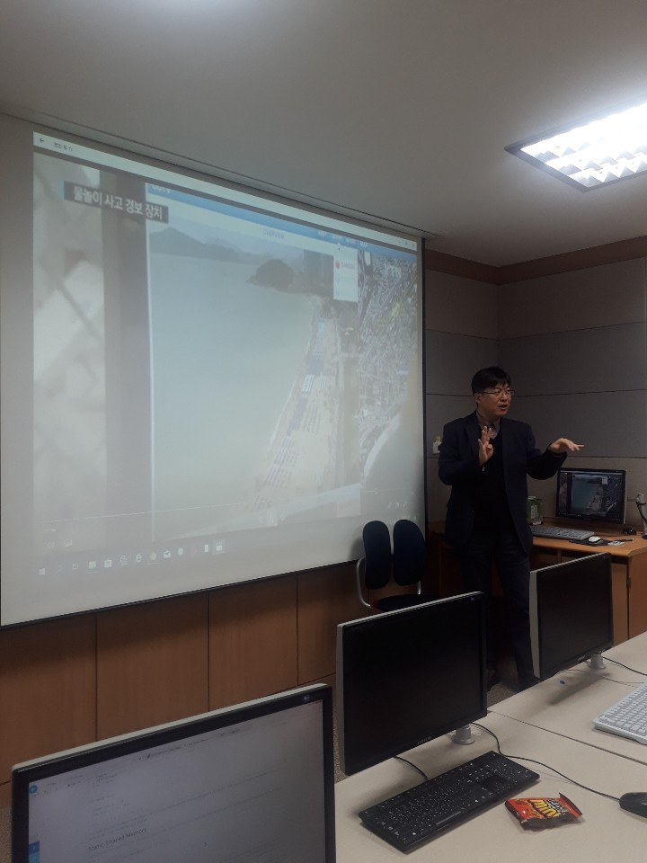

## 병렬 컴퓨팅 - 캡스톤

*  *  *

### 알림: Capstone 중간보고서 제출 --> [제출 형식](https://github.com/jeonggunlee/Parallel_Programming_2018_Fall/blob/master/Capstone/%EC%A4%91%EA%B0%84%EB%B3%B4%EA%B3%A0%EC%84%9C.hwp) 참조

>   11월 2일 오후 3시까지 !

*  *  *

## 딥러닝/영상처리 가속화를 위한 병렬 컴퓨티 기술 연구

춘천에 위치한 [지오멕스소프트, GeoMex Soft](http://www.geomex.co.kr/KR/index.html)는 지능형 CCTV 및 관제 시스템을 개발하는 회사입니다.
최근 지능형 CCTV에 인공지능의 한 형태인 머신러닝/딥러닝 등이 많이 활용되고 있습니다. 지오멕스소프트 역시 딥러닝을 활용한 지능형 CCTV를 개발하고 있으며, 최근 딥러닝을 이용한 자동차 번호판 인식 자체 솔루션 개발, 침입/배회/유기 탐지 소프트웨어 기술을 개발한 바 있습니다.

이러한 딥러닝 기반의 영상처리에 있어, 병렬 컴퓨팅은 매우 중요한 역활을 합니다. 여러분이 본 수업을 통해 진행할 캡스톤 과제 후보는 다음과 같습니다.

**기업추천 캡스톤 과제 목록**

    - 딥러닝 기반의 영상처리에 있어, CNN의 병렬가속화에 대한 분석 및 성능 평가
    - GPU Tensor Core의 활용에 대한 분석 및 성능 평가
    - 딥러닝 연산에 있어 중요한 역활을 하는 Matrix 연산에 대한 병렬화 기술 및 분석 그리고 성능 평가 (딥러닝에서 행렬곱이 어떻게 활용되는지 조사)
    
    
위 과제 중 하나를 선택하여 종합설계를 진행해주기 바랍니다.

*  *  *
## 팀 구성

    - 팀 A: 조서연, 김규민, 서종찬, 김태현 <--> Special Force Team A
        - 병렬곱 연산의 딥러닝 활용 방식 분석 및 CUDA를 이용한 행렬곱 병렬 가속화 성능평가
        
    - 팀 B: 이준범, 양형모, 고동환, 김혜빈 <--> Special Force Team B
        - CUDA를 활용한 Convolutional Neural Network (CNN) 성능 향상 기법 분석 및 성능평가
        
    - 팀 C: 조준형, 한승탁, 김용호, 이호중 <--> Special Force Team C
        - Tensor Core 기반의 행렬곱 가속화 및 딥러닝 적용 방식 분석
    

## Special Force (대학원 지원팀)

    - 팀 A: 정다운, 민진우 - Matrix Multiplication Acceleration with CUDA
    - 팀 B: 이주상, 조현상 - CNN Acceleration
    - 팀 C: 왕종성, 민재홍, Mahlet - Tensor Core Based Accleration
    
*  *  *

##  11월 20일
  지오멕스 소프트 대표이사 "심재민" 대표님의 캡스톤 과제 내용의 중요성 및 실제 사용 사례
  
  
  

*  *  *

## 참고 자료
   - [CUDA를 이용한 행열 곱셈](https://sites.google.com/site/5kk73gpu2013/examples/example-matrixmul)
   - [Tensor Core를 이용한 행렬 연산](https://devblogs.nvidia.com/programming-tensor-cores-cuda-9/)
   - [CUDA를 이용한 CNN 설계](https://sites.google.com/site/5kk73gpu2013/assignment/cnn)
   - [OpenMP를 이용한 CNN 설계](https://github.com/m-tavana/CNN_OPENMP)
   - [알기 쉬운 GPU 그리고 머신러닝](https://steemit.com/gpu/@sigmoid/gpu?fbclid=iwar0bk3twq5xtbeohxinlxeht6cpdlgwkn4fcdlupnlkjkjmtoncvwevl3sq)
